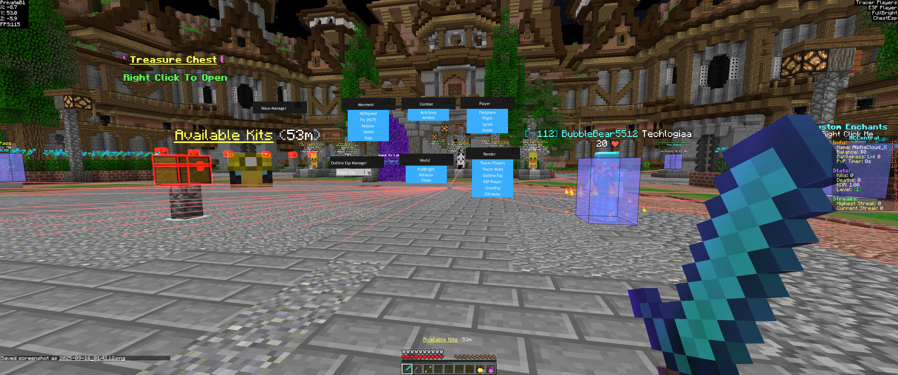

# Minecraft Custom Client Showcase

This repository contains a selection of media showcasing a **custom Minecraft cheating client** developed between late 2016 and 2019. The client includes visual enhancements, in-game modifications, and automated features.

Several iterations have been lost over time, but these mostly expanded on modernizing the main menu with repositioned buttons, OpenGL custom shapes, and RGB-themed chat colours. These updates were worked on around 2021.

This was the first major project that got me into coding.

---

## Automated Features

### Speed Cheat Bypass

  
**Description:** Demonstrates my custom speed cheat bypassing the anti-cheat completely without any flagging.

### Combat Cheats & Client UI

  
**Description:** Shows the combat cheats in action and the client UI used to enable/disable combat-related features.

### Step Cheat

  
**Description:** Demonstrates the step cheat, allowing movement up more blocks than normally permitted.

---

## Main Menu

  
**File:** `20190610_120214.jpg`  
**Description:** Sample of the main menu with a **custom background** and interactive **menu buttons**.

---

## In-Game Modifications

  
**File:** `2025-09-16_01.42.20.png`  
**Description:** Screenshot showing several enabled features:
- **Tracers Player:** Lines pointing towards players.  
- **ESP Player:** Highlights players through walls.  
- **Full Bright:** Forces full brightness in dark areas.  
- **Chest ESP:** Highlights chests.  
- **Click GUI:** In-game interface for toggling features.

---

## Transition to Python & Deep Learning

### Object Detection & Aim Assist (2022)

  
**Description:** Showcases a fully external cheat using deep learning for aim assistance. The original Minecraft client I created is visible in the bottom right corner, running on a duplicate account. This marks my transition into Python and computer vision-based automation at the start of 2022. Yes, before ChatGPT and all the hype around it came out!

---

## Historical Context
- Features were developed **from late 2016 through summer 2019**.  
- The speed modifications were last tested in summer 2019.  
- Images and videos showcase the client’s evolution and capabilities.  

## Transition to Python & Recent Work
- Around 2020, I shifted focus from Minecraft cheats to Python automation projects.  
- An example of this transition can be seen in the object detection/aim assist video from 2022.  
- More recent projects are available on my YouTube channel: [AlphaCloud](https://www.youtube.com/@AlphaCloud).  
- My top video, aimed at helping a younger audience set up their development environment, has amassed almost **14,000 views**, marking a full circle in my coding journey to now being someone who creates the videos that I once used to watch.
---

*⚠️ Note: All content in this repository is for educational and archival purposes only. The cheats no longer bypass current Minecraft protections and are not maintained.*
